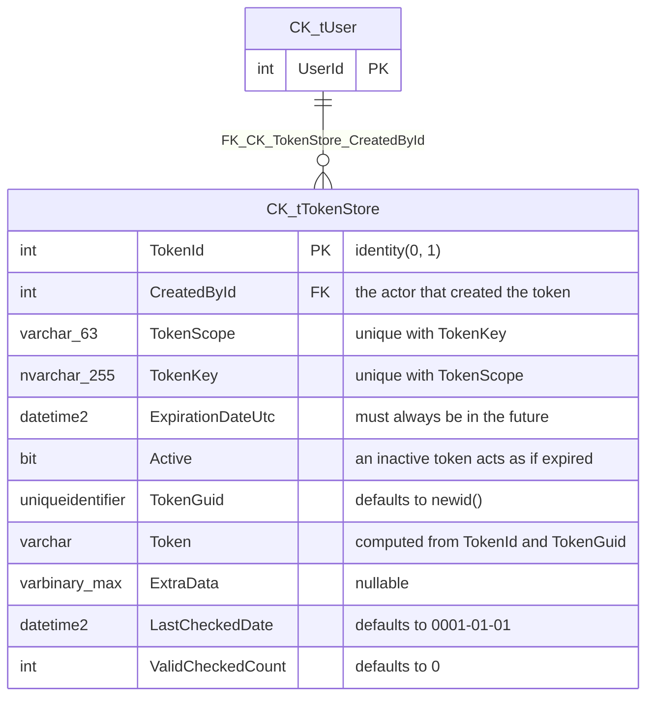

# CK.DB.TokenStore

This package is based on **CK.DB.Actor** which introduces the Actor/User/Group model. It adds a
generic token store to the picture: a token is an opaque, expirable, revocable string that a process
can hand out and later check, without having to invent its own storage.

A token is identified by a functional couple - a **Scope** (the functional area or purpose) and a
**Key** (business data whose unicity must be enforced inside that scope, such as an email address or
the SHA1 of a document). The pair is unique, which is what makes the store usable as a "one pending
operation per subject" guard rather than a plain token bag.

## The relational model.



`CK.tUser` belongs to [CK.DB.Actor](https://github.com/signature-opensource/CK-DB/tree/develop/CK.DB.Actor#readme)
and is shown here only as the target of the foreign key.

The table is defined by
[Model.CK.TokenStoreTable.Install.3.0.0.sql](Res/Model.CK.TokenStoreTable.Install.3.0.0.sql). The
`Install.1.0.0.to.2.0.0` and `Install.2.0.0.to.3.0.0` scripts are migration deltas, not the current
shape - `[Versions( "1.0.0, 2.0.0, 3.0.0" )]` on `TokenStoreTable` is what drives them.

## The token itself is not the primary key.

`Token` is a computed column: `TokenId` and `TokenGuid` concatenated with a dot, both cast with a
binary collation. So the string handed to the outside world is `"42.6f9619ff-8b86-d011-b42d-00c04fc964ff"`.

This matters:

- The value given out is **not guessable** from the identifier, because the GUID half is random
  (`default( newid() )`).
- [`sTokenCheck`](Res/sTokenCheck.sql) splits it back with `parsename` and requires **both** halves
  to match the row. A malformed token, an unknown `TokenId`, or a right `TokenId` with a wrong GUID
  are all treated identically - as missing.
- Nothing in the schema prevents you from storing the `TokenId` on your side; the full `Token` is
  what you must never keep in a place you would not keep a password.

## Invariants and reserved values.

- **`TokenId` 0 is reserved.** The install script inserts one row with an empty key, an empty scope,
  the min date, `Active = 0` and a zero GUID. `ITokenInfo.TokenId == 0` is therefore the universal
  "no token" answer, and it is what a failed `CheckAsync` returns.
- **`ExpirationDateUtc` must always be in the future when written.**
  [`sTokenCreate`](Res/sTokenCreate.sql) and [`sTokenActivate`](Res/sTokenActivate.sql) both
  `throw 50000, 'Argument.InvalidExpirationDateUtc', 1` otherwise. A date in the past is a bug, not a
  way to create an already-expired token - deactivate it instead.
- **`Active = 0` acts exactly like an expired token**, and it is reversible. This is the intended way
  to revoke.
- **Creation is not an upsert.** If the `(TokenKey, TokenScope)` couple already exists,
  `sTokenCreate` returns `TokenIdResult = 0` and an empty `TokenResult` instead of raising. Callers
  must test `CreateResult.Success`.
- **Checking a valid token extends it.** See below - a successful check is a write.
- `TokenId <= 0` is rejected by `sTokenActivate`, `sTokenDestroy` and `sTokenExtraDataSet` with
  `'Argument.InvalidTokenId'`, which is why the reserved row 0 cannot be modified through the API.

## Checking a token is a write, on purpose.

[`sTokenCheck`](Res/sTokenCheck.sql) does more than answer yes or no. On success it increments
`ValidCheckedCount`, sets `LastCheckedDate` to now, and **postpones the expiration date** so that it
is at least `@SafeTimeSeconds` away - 600 seconds (10 minutes) by default:

```sql
declare @SafeExpires datetime2(2) = dateadd(second, @SafeTimeSeconds, @Now);
if @ExpirationDateUtc < @SafeExpires
begin
    set @ExpirationDateUtc = @SafeExpires;
end
```

The reason is that a token is usually checked at the start of a multi-step operation. Without the
safe period, a token valid for 3 more seconds would pass the check and then expire in the middle of
the work it authorized. The guarantee offered is therefore not "it was valid" but "it is valid and
stays valid for at least the safe period".

The counters are the audit trail: a token with a high `ValidCheckedCount` has been replayed, which is
worth noticing for single-use tokens.

## The TokenStoreTable API.

[`TokenStoreTable`](TokenStoreTable.cs) exposes the stored procedures; a `.Sync` partial
([TokenStoreTable.Sync.cs](TokenStoreTable.Sync.cs)) provides the synchronous overloads.

```csharp
/// <summary>
/// Creates a new token.
/// </summary>
/// <returns>The <see cref="CreateResult"/> with the token identifier and token to use.</returns>
[SqlProcedure( "sTokenCreate" )]
public abstract Task<CreateResult> CreateAsync( ISqlCallContext ctx, int actorId, [ParameterSource] ITokenInfo info );

/// <summary>
/// Checks whether a token is valid or not.
/// If valid, <see cref="ITokenInfo.ValidCheckedCount"/> and <see cref="ITokenInfo.LastCheckedDate"/> will be updated.
/// If not valid, <see cref="ITokenInfo.TokenId"/> will be zero and
/// <see cref="ITokenInfo.ExpirationDateUtc"/> will be <see cref="Core.Util.UtcMinValue"/>.
/// By default, this uses a safe period of 600 seconds (10 minutes): whenever this check is successful, the expiration date
/// is guaranteed to be at least in 10 minutes (it is postponed as required).
/// </summary>
[SqlProcedure( "sTokenCheck" )]
public abstract Task<ITokenInfo> CheckAsync( ISqlCallContext ctx, int actorId, string token );

[SqlProcedure( "sTokenCheck" )]
public abstract Task<ITokenInfo> CheckAsync( ISqlCallContext ctx, int actorId, string token, int safeTimeSeconds );

/// <summary>
/// Updates the token activity state and/or expiration date.
/// </summary>
/// <param name="active">When not null, this is the new activity state. <c>false</c> will deactivate the token.</param>
/// <param name="expirationDateUtc">When not null, this new expiration date must be in the future otherwise an exception is thrown.</param>
[SqlProcedure( "sTokenActivate" )]
public abstract Task ActivateAsync( ISqlCallContext ctx, int actorId, int tokenId, bool? active = null, DateTime? expirationDateUtc = null );

/// <summary>
/// Sets any extra data associated to this token. This data typically supports the process associated to this token.
/// </summary>
[SqlProcedure( "sTokenExtraDataSet" )]
public abstract Task SetExtraDataAsync( ISqlCallContext ctx, int actorId, int tokenId, byte[]? extraData );

[SqlProcedure( "sTokenDestroy" )]
public abstract Task DestroyAsync( ISqlCallContext ctx, int actorId, int tokenId );
```

Creation goes through [`ITokenInfo`](ITokenInfo.cs), an `IPoco` used as a `[ParameterSource]`: the
poco properties are mapped onto the procedure parameters, so there is no long parameter list to keep
in sync. Get one with `CreateInfo()` or `CreateInfo<T>( configurator )` - never by implementing the
interface yourself.

```csharp
var info = tokenStore.CreateInfo( i =>
{
    i.TokenScope = "PasswordReset";
    i.TokenKey = userEmail;
    i.ExpirationDateUtc = DateTime.UtcNow.AddHours( 2 );
    i.Active = true;
} );
var r = await tokenStore.CreateAsync( ctx, actorId, info );
if( !r.Success ) { /* a token already exists for this (scope, key) */ }
```

On the read side, [`TokenStoreExtensions.IsValid`](TokenStoreExtensions.cs) is the client-side
counterpart of the SQL check - it validates a returned `ITokenInfo` (non-zero `TokenId`, future
expiration, `Active`) with an optional tolerance:

```csharp
public static bool IsValid( this ITokenInfo @this, TimeSpan? allowedDelta = null )
```

## SQL objects.

| Object | Kind | Source |
|--------|------|--------|
| `CK.tTokenStore` | table | [Res/Model.CK.TokenStoreTable.Install.3.0.0.sql](Res/Model.CK.TokenStoreTable.Install.3.0.0.sql) |
| `CK.sTokenCreate` | procedure | [Res/sTokenCreate.sql](Res/sTokenCreate.sql) |
| `CK.sTokenCheck` | procedure | [Res/sTokenCheck.sql](Res/sTokenCheck.sql) |
| `CK.sTokenActivate` | procedure | [Res/sTokenActivate.sql](Res/sTokenActivate.sql) |
| `CK.sTokenExtraDataSet` | procedure | [Res/sTokenExtraDataSet.sql](Res/sTokenExtraDataSet.sql) |
| `CK.sTokenDestroy` | procedure | [Res/sTokenDestroy.sql](Res/sTokenDestroy.sql) |

There is no view and no function: nothing here is meant to be queried directly. Reading a token
outside of `sTokenCheck` would bypass the safe-period extension and the counters.

## Extension points for other packages.

The procedures are seeded with transformation markers so that a package built on top of this one can
inject behaviour without forking the SQL:

| Marker | In | Typical use |
|--------|----|-------------|
| `--<PreCreate revert />` / `--<PostCreate />` | `sTokenCreate` | side tables filled in the same transaction |
| `--<OnTokenDuplicate />` | `sTokenCreate` | react to the `(scope, key)` collision |
| `--<OnTokenMissing />` / `--<OnTokenExpired />` | `sTokenCheck` | audit failed checks |
| `--<AdditionalSecurity />` | `sTokenCheck` | extra conditions before declaring the token valid |
| `--<OnTokenChecked />` | `sTokenCheck` | audit successful checks |
| `--<PreDestroy revert />` / `--<PostDestroy />` | `sTokenDestroy` | clear dependent rows before the token row - a table with a foreign key to `CK.tTokenStore` must inject here, or the delete is rejected |

`revert` on a marker means the injected fragments are emitted in reverse dependency order, which is
what you want for the "pre" half of a create/destroy pair.

## Setup dependencies.

[`Package`](Package.cs) declares its dependency structurally:

```csharp
[SqlPackage( Schema = "CK", ResourcePath = "Res" )]
[Versions( "1.0.0" )]
public abstract class Package : SqlPackage
{
    internal void StObjConstruct( CK.DB.Actor.Package actor ) { }
}
```

The `StObjConstruct` parameter is the whole dependency declaration: it guarantees that `CK.tUser`
exists before `CK.tTokenStore` is created, so the foreign key can be installed.

## This package does not transform `CK.sUserDestroy`.

`Res/` contains no `.tql` at all, and `FK_CK_TokenStore_CreatedById` has no `on delete cascade`. So a
user who has created at least one token cannot be destroyed: the `delete from CK.tUser` inside
`CK.sUserDestroy` is rejected by the constraint.

A package that owns rows referencing `CK.tUser` normally injects its own `delete` into the `PreDestroy`
section of `CK.sUserDestroy` to make the destruction possible. Whether this package should do the same
is a design question, not an oversight to assume: a token records *who* created it, and silently
dropping that history when the creator is removed is not obviously the right call. Until it is settled,
an application that destroys users has to clear their tokens itself.
